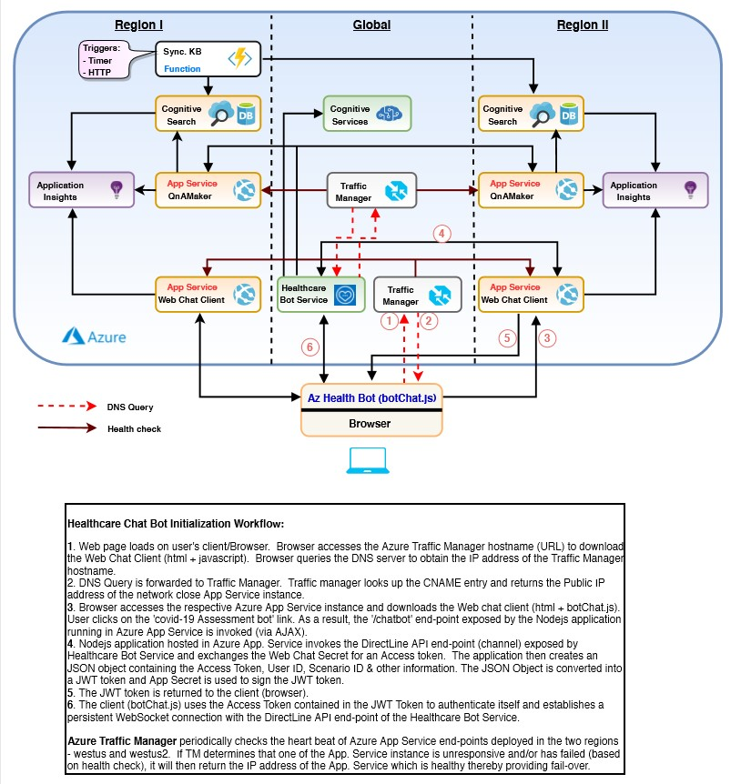

# Deploy the reference architecture for Microsoft Healthcare Bot and QnAMaker

<!-- 
Guidelines on README format: https://review.docs.microsoft.com/help/onboard/admin/samples/concepts/readme-template?branch=master

Guidance on onboarding samples to docs.microsoft.com/samples: https://review.docs.microsoft.com/help/onboard/admin/samples/process/onboarding?branch=master

Taxonomies for products and languages: https://review.docs.microsoft.com/new-hope/information-architecture/metadata/taxonomies?branch=master
-->

This GitHub repo. contains the ARM templates for deploying Health Bot reference architecture. 

## Contents

| File/Folder       | Description                                |
|-------------------|--------------------------------------------|
| `ARM Templates`   | ARM Template to deploy the reference architecture.|
| `CHANGELOG.md`    | List of changes to the template.|
| `CONTRIBUTING.md` | Guidelines for contributing to the template.|
| `README.md`       | This README file.|
| `LICENSE`         | The license for the template.|

## Prerequisites

1. A **GitHub** Account to clone and/or fork this repository.

2. An Azure **Resource Group** with **Owner** *Role* permission.  All Azure resources will be deployed into this resource group.

3. Review the ARM template `azuredeploy.json` before proceeding. Update the resource configuration parameters to meet your requirements.

4. (Optional) Latest version of the following tools installed on a workstation or on an Azure virtual machine.
   - Azure CLI
   - GitHub CLI

## Reference Architecture



Readers can refer to the following resources as needed.

- [Azure CLI 2.0](https://docs.microsoft.com/en-us/cli/azure/install-azure-cli?view=azure-cli-latest)
- [Azure Resource Manager Documentation](https://docs.microsoft.com/en-us/azure/azure-resource-manager/)
- [Azure Resource Manager Template Reference](https://docs.microsoft.com/en-us/azure/templates/)
- [Microsoft Health Bot Documentation](https://docs.microsoft.com/en-us/healthbot/)
- [Azure Cognitive Services Documentation](https://docs.microsoft.com/en-us/azure/cognitive-services/)
- [Azure QnA Maker Documentation](https://docs.microsoft.com/en-us/azure/cognitive-services/qnamaker/)
- [Azure Cognitive Search Documentation](https://docs.microsoft.com/en-us/azure/search/)
- [Azure Function Documentation](https://docs.microsoft.com/en-us/azure/azure-functions/)

## Setup

Follow the steps below to deploy the Health Bot resources on Azure.

1. Login to Azure

   Open a terminal window or login to the Azure [Cloud Shell](http://shell.azure.com).

   Refer to the commands below to login to Azure from a command prompt in a VM.  You can skip this step if you are using the Azure Cloud shell.

   ```bash
   # Login to Azure
   $ az login
   #
   ```

2. Clone this repository

   Clone this GitHub repository to your local VM or cloud shell.  Refer to the command snippet below.

   ```bash
   # Create a directory to store all Git projects
   $ mkdir git-repos
   #
   # Switch to the 'git-repos' directory
   $ cd git-repos
   #
   # Clone this GitHub repository.
   $ git clone https://github.com/microsoft/HealthBotRefArchDeploy.git
   #
   # Switch to the Health Bot project root directory
   $ cd HealthBotRefArchDeploy
   #
   ```

3. Validate the ARM deployment

   Follow the steps in the command snippet below to validate the ARM template.
   
   ```bash
   # (Optional) Create a resource group
   # Substitute correct values for the following
   #   - group-name : Name of the resource group
   #   - region-name : Azure region for the resource group
   #
   $ az create group -n <group-name> -l <region-name>
   #
   # Validate the ARM template. Make sure there are no errors.
   #
   $ az group deployment validate --verbose --resource-group <group-name> --template-file azuredeploy.json --parameters @./azuredeploy.parameters.json
   #
   ```

4. Run the ARM deployment

   Follow the steps in the command snippet below to run the ARM template and provision the Health Bot resources on Azure.
   
   ```bash
   # Deploy resources defined in the ARM template
   #
   $ az group deployment create --verbose --resource-group <group-name> --template-file azuredeploy.json --parameters @./azuredeploy.parameters.json
   #
   ```

5. Verify Azure Resources

   Login to the Azure portal and confirm all resources got provisioned in the resource group correctly.

## Contributing

This project welcomes contributions and suggestions.  Most contributions require you to agree to a
Contributor License Agreement (CLA) declaring that you have the right to, and actually do, grant us
the rights to use your contribution. For details, visit https://cla.opensource.microsoft.com.

When you submit a pull request, a CLA bot will automatically determine whether you need to provide
a CLA and decorate the PR appropriately (e.g., status check, comment). Simply follow the instructions
provided by the bot. You will only need to do this once across all repos using our CLA.

This project has adopted the [Microsoft Open Source Code of Conduct](https://opensource.microsoft.com/codeofconduct/).
For more information see the [Code of Conduct FAQ](https://opensource.microsoft.com/codeofconduct/faq/) or
contact [opencode@microsoft.com](mailto:opencode@microsoft.com) with any additional questions or comments.
