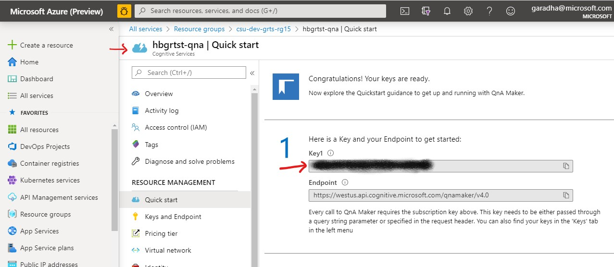
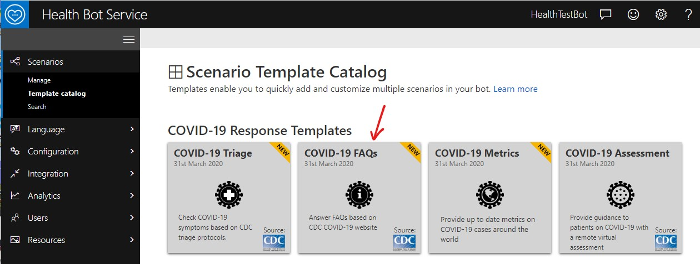
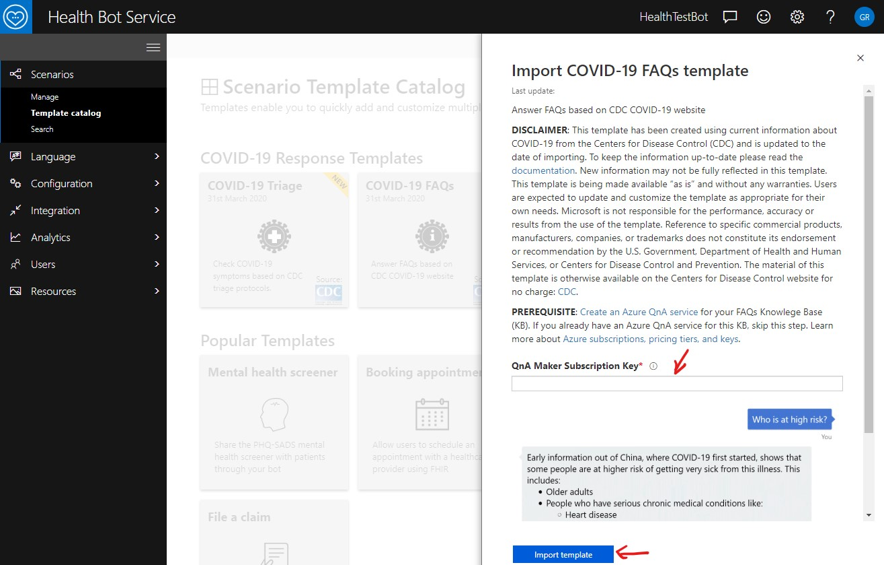
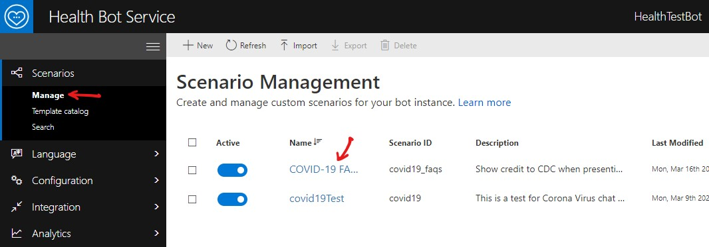
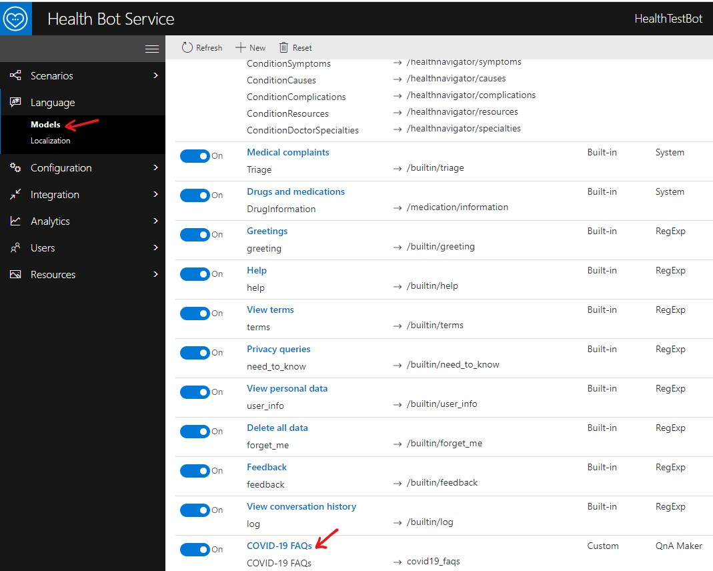
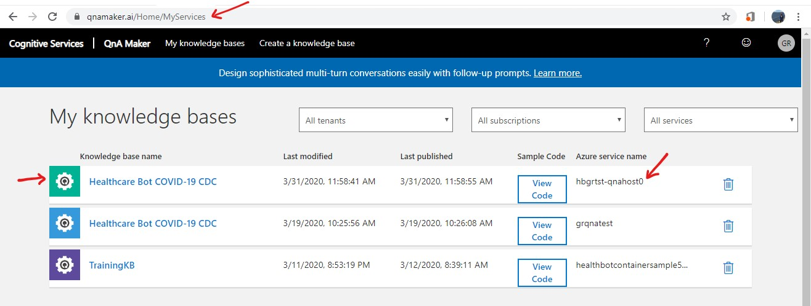

# Deploy the reference architecture for Microsoft Healthcare Bot and QnAMaker

<!-- 
Guidelines on README format: https://review.docs.microsoft.com/help/onboard/admin/samples/concepts/readme-template?branch=master

Guidance on onboarding samples to docs.microsoft.com/samples: https://review.docs.microsoft.com/help/onboard/admin/samples/process/onboarding?branch=master

Taxonomies for products and languages: https://review.docs.microsoft.com/new-hope/information-architecture/metadata/taxonomies?branch=master
-->

This GitHub repo. contains the ARM template for deploying Health Bot reference architecture.

## Contents

| File/Folder       | Description                                |
|-------------------|--------------------------------------------|
| `ARM Template`   | ARM Template `azuredeploy.json` to provision the Azure resources in the reference architecture.|
| `CHANGELOG.md`    | List of changes to the template.|
| `CONTRIBUTING.md` | Guidelines for contributing to the template.|
| `README.md`       | This README file.|
| `LICENSE`         | The license for the template.|

## Prerequisites

1. A **GitHub** Account to clone and/or fork this repository.

2. An Azure **Resource Group** with **Owner** *Role* permission.  All Azure resources will be deployed into this resource group.

3. A **Health Bot** instance.  Refer to [Create your first Healthcare Bot](https://docs.microsoft.com/en-us/healthbot/quickstart-createyourhealthcarebot) quickstart in the Health Bot documentation.

3. Review the **ARM template** `azuredeploy.json` before proceeding. Update the resource configuration parameters to meet your requirements.

4. (Optional) The following CLI tools are preinstalled in Azure Cloud Shell.  In case you are planning to use a workstation or a VM to deploy the ARM template, install the CLI tools before proceeding.  Links for downloading the tools are provided in the next section.

   - Azure CLI
   - GitHub CLI

## Reference Architecture

The aim of this reference architecture is multifold.
a. Help customers quickly deploy Microsoft **Health Bot** and **Cognitive Services** resources in **Production** region on Azure.
b. Describe the integration touch points between the Health Bot, Azure Cognitive Services and Web Chat Client application.  Azure Cognitive Services includes Congitive Search, QnA Maker and other AI services.
b. Guide customers to provision the Microsoft Health Bot resources in a highly available fault tolerant configuration.  Core services of the solution such as the Web Chat Client, QnA Maker runtime and Azure Cognitive Search are deployed in two separate Azure regions to provide for automatic failover.


Readers are advised to refer to the following resources as needed.

- [Azure CLI 2.0](https://docs.microsoft.com/en-us/cli/azure/install-azure-cli?view=azure-cli-latest)
- [Git SCM Docs](https://git-scm.com/book/en/v2)
- [Azure Resource Manager Documentation](https://docs.microsoft.com/en-us/azure/azure-resource-manager/)
- [Azure Resource Manager Template Reference](https://docs.microsoft.com/en-us/azure/templates/)
- [Microsoft Health Bot Documentation](https://docs.microsoft.com/en-us/healthbot/)
- [Web Chat Client GitHub Repository](https://github.com/ganrad/HealthBotContainerSample)
- [Azure Cognitive Services Documentation](https://docs.microsoft.com/en-us/azure/cognitive-services/)
- [Azure QnA Maker Documentation](https://docs.microsoft.com/en-us/azure/cognitive-services/qnamaker/)
- [Business Continuity Plan for QnA Maker Service](https://docs.microsoft.com/en-us/azure/cognitive-services/qnamaker/how-to/business-continuity-plan)
- [Azure Cognitive Search Documentation](https://docs.microsoft.com/en-us/azure/search/)
- [Synchronize Azure Search Indexes](https://github.com/ganrad/AzSearchSyncIndexes)
- [Azure Function Documentation](https://docs.microsoft.com/en-us/azure/azure-functions/)

## Important Notes

- Unless otherwise noted explicitly, the first **region** listed in the **locations** parameter (array) will be referred to as the **primary** and the second region will denote the **secondary**.
- Use an alpha numeric name for the **deployment** name template parameter.  All Azure resources deployed by the ARM template will have names prefixed with this deployment name.
- Azure Traffic Manager is used to shift the **Web Chat Client** and **QnA Maker** API traffic across the individual Azure App Service instances deployed in the two regions.  The end user (customer) is responsible for configuring the respective traffic routing algorithm in the Traffic Manager to ensure the traffic is split evenly between the App Service instances as per their requirements. 

## A] Deploy the ARM Template

Follow the steps below to deploy the Health Bot resources on Azure.

1. Review and update template parameters in the `azuredeploy.parameters.json` file

   Refer to the table below for a description of the template parameters.  Configure the values as per your requirements.

   Parameter Name | Type | Description
   -------------- | ---- | -----------
   name | string | A **unique name** for this deployment.  All provisioned resource names will be prefixed with this name. This includes the web site and traffic manager FQDN's.
   locations | array (of strings) | Specify Azure region names (max. 2) where the resources need to be provisioned. The resources can be provisioned in a max. of 2 regions.
   WEBCHAT_SECRET | string | Health Bot instance **webchat_secret**.  Retrieve this secret value from the Health Bot Portal. Refer to the Health Bot documentation [here](https://docs.microsoft.com/en-us/healthbot/channels/webchat). 
   APP_SECRET | string | Health Bot instance **app_secret**. Obtain this secret value from the Health Bot Portal.
   appServicePlanSku | object | Use this object to specify the SKU size for the Azure App Service Plans.
   workerSize | string | Specify the number of workers in the Azure App Service Plan.
   qnaMakerServiceLocation | string | QnA Maker resource location.  This should be set to **westus** for all commercial deployments.
   qnaMakerServiceSku | string | Specify the SKU size for the Cognitive Services account.
   qnaMakerSearchSku | string | Specify the SKU size for the Cognitive Search instances.
   webchatRepoUrl | string | Web Chat Client GitHub repository uri. Use the default value as-is.
   webchatRepoBranch | string | Web Chat Client GitHub repository branch.  Use the default value (`master`).  If Web Chat Client **v3** is desired, then set the value to **webchat_v3**.
   funcRepoUrl | string | GitHub repository uri for Azure Functions.  The functions synchronize the knowledge bases (indexs) between the Azure Search instances deployed in two different regions. 
   funcRepoBranch | string | GitHub repository branch for Azure Functions.  Use the default value (`master`).

2. Login to Azure

   Open a terminal window or login to the Azure [Cloud Shell](http://shell.azure.com).

   Refer to the commands below to login to Azure from a command prompt in a VM.  You can skip this step if you are using the Azure Cloud shell.

   ```bash
   # Login to Azure
   $ az login
   #
   ```

3. Clone this repository

   Clone this GitHub repository to your local VM or cloud shell.  Refer to the command snippet below.

   ```bash
   # Create a directory to store all Git projects
   $ mkdir git-repos
   #
   # Switch to the 'git-repos' directory
   $ cd git-repos
   #
   # Clone this GitHub repository.
   $ git clone https://github.com/microsoft/HealthBotRefArchDeploy.git
   #
   # Switch to the Health Bot project root directory
   $ cd HealthBotRefArchDeploy
   #
   ```

4. Validate the ARM deployment

   Follow the steps in the command snippet below to validate the ARM template.
   
   ```bash
   # (Optional) Create a resource group
   # Substitute correct values for the following
   #   - group-name: Name of the resource group
   #   - region-name: Azure region for the resource group
   #
   $ az group create -n <group-name> -l <region-name>
   #
   # Validate the ARM template. Make sure there are no errors.
   #
   $ az deployment group validate --verbose --resource-group <group-name> --template-file azuredeploy.json --parameters @./azuredeploy.parameters.json
   #
   ```

5. Run the ARM deployment

   Follow the steps in the command snippet below to run the ARM template and provision the Health Bot resources on Azure.
   
   ```bash
   # Deploy resources defined in the ARM template
   # Substitute correct values for the following
   #   - group-name: Name of the resource group
   #
   $ az deployment group create --verbose --resource-group <group-name> --template-file azuredeploy.json --parameters @./azuredeploy.parameters.json
   #
   ```
   >**NOTE:** The ARM template will run for approximately 15 - 20 minutes.  Be patient and treat yourself to a cookie.

6. Verify Azure Resources

   Login to the Azure portal and confirm all resources got provisioned in the resource group correctly.

## B] Post-deployment Configuration

The following steps have to be completed manually once the ARM template is deployed and all required resources have been provisioned on Azure.

1. Generate the QnA Maker **Knowledge Base** for **COVID-19 FAQs** in the **Health Bot Service** Portal

   Login to *Azure Portal* and retrieve the QnA Maker **Subscription Key** by accessing the *Cognitive Service*.  The Cognitive Service resource should have a name that ends with **-qna**.  See screenshot below.

   

   Login to *Health Bot Service Portal*, access the **Scenario Template Catalog** and create a QnA Model using **COVID-19 FAQs** template. See screenshots below.

   

   Specify the QnA Maker Subscription Key which you retrieved in the previous step.  Then click on **Import template**.

   

   Exit out of the *Scenario Editor*.  The previous step creates the following resources which can be viewed by accessing the respective portals.  See below.

   **Health Bot Service Portal**
   - Scenario : COVID-19 FAQs

     

   - Model : COVID-19 FAQs

     

   **Azure Portal**
   - Cognitive Search : Name ends with **-search0**.  Verify Index has been created.

     

   **QnA Maker Portal**
   - Knowledge Base : Healthcare Bot COVID-19 CDC

     

   Review the above resources.
   
2. Back up the QnA Maker runtime in **primary** region and restore it in the **secondary** region

   The ARM template deploys one **Cognitive Services** resource and two QnA Maker App Service instances, one in each region. The template deploys the **QnA Maker** runtime only in the App Service instance deployed in the primary region. As a consequence, the QnA Maker runtime has to be deployed in the secondary region.  The quickest and easiest way is to take a back up of the QnA Maker App Service instance in the primary region and restore it in the secondary region.

   Refer to [Back up an app](https://docs.microsoft.com/en-us/azure/app-service/manage-backup) to take a back up of the QnA Maker App Service in the **primary** region. The QnA Maker App Service in the primary region would have a name ending with **-qnahost0**.

   Refer to [Restore a backup](https://docs.microsoft.com/en-us/azure/app-service/web-sites-restore) to restore the back up from primary into the secondary region.  The QnA Maker App Service in the secondary region would have a name ending with **-qnahost1**.

3. Reconfigure the QnA Maker runtime in **secondary** region

   Update QnA Maker App Service application settings in **secondary** region.


   In Azure Portal, access the QnA Maker App Service instance in **secondary** region.  The name for this resource should end with **-qnahost1**.  Access the **Configuration** blade of the App Service and update the values of application settings listed in the table below.

   Parameter Name | Description
   -------------- | -----------
   AzureSearchName | Specify the name of the Cognitive Search resource. Name of this resource should end with **-search1**.
   AzureSearchAdminKey | Specify the value of Cognitive Search Admin key (Primary admin key). You can retrieve this key by accessing the **Keys** blade of the Cognitive Search instance.
   UserAppInsightsAppId | Application Insights App ID
   UserAppInsightsKey | Application Insights Instrumentation Key
   UserAppInsightsName | Application Insights resource name

   >**NOTE:** Remember to specify the names of the resources and application insights keys deployed in the **secondary** region.

   Click **Save** and this will restart the QnA Maker App Service in the **secondary** region.

4. Synchronize the Azure Search **Indexes** in the **primary** and **secondary** regions

   Finally, invoke the *Azure Function* to copy the search **indexes** from the Cognitive Search instance in primary to secondary.

   The Azure Function name ends with **-qnakb-sync** and is deployed in **primary** region.  This Function is configured with both an **HTTP** and **Timer** trigger.

   To initiate the synchronization process manually, issue a HTTP `GET` API call to the Function HTTP endpoint (below) from a web browser or a terminal window (using `curl` command).

   http://[name]-qnakb-sync.azurewebsites.net/api/httpcogsearchkbsync

   Substitute the **deployment** name in the `name` placeholder above.

   >**NOTE:** The source code for the Azure Search [synchronization function](https://github.com/ganrad/AzSearchSyncIndexes) is available on GitHub.  The synchronization code can also be run as a standalone program.  The source code for the [standalone](https://github.com/pchoudhari/QnAMakerBackupRestore) program is also available on GitHub.

## Contributing

This project welcomes contributions and suggestions.  Most contributions require you to agree to a
Contributor License Agreement (CLA) declaring that you have the right to, and actually do, grant us
the rights to use your contribution. For details, visit https://cla.opensource.microsoft.com.

When you submit a pull request, a CLA bot will automatically determine whether you need to provide
a CLA and decorate the PR appropriately (e.g., status check, comment). Simply follow the instructions
provided by the bot. You will only need to do this once across all repos using our CLA.

This project has adopted the [Microsoft Open Source Code of Conduct](https://opensource.microsoft.com/codeofconduct/).
For more information see the [Code of Conduct FAQ](https://opensource.microsoft.com/codeofconduct/faq/) or
contact [opencode@microsoft.com](mailto:opencode@microsoft.com) with any additional questions or comments.
